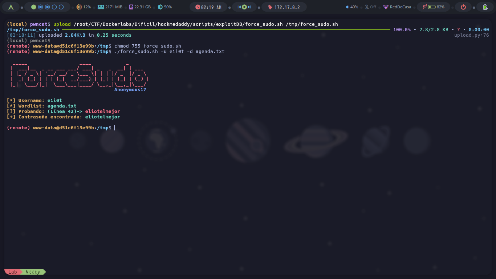
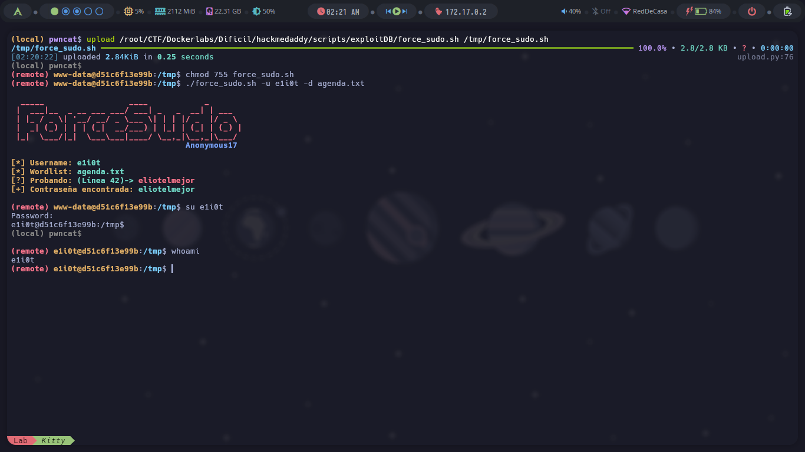

# 🔐 force_sudo.sh

`force_sudo.sh` es una herramienta de fuerza bruta para sistemas Linux/Unix que permite probar múltiples contraseñas contra un usuario del sistema usando un diccionario, intentando autenticarse con `su` en modo silencioso y rápido.

⚠️ **Uso exclusivo para propósitos educativos y de pruebas éticas autorizadas.**

---

## 🧠 Descripción

Este script automatiza ataques de diccionario para encontrar la contraseña de un usuario local en sistemas GNU/Linux. Usa `su` en combinación con `bash` y `timeout` para probar contraseñas rápidamente sin bloquear el sistema, ni generar demasiada salida. Su principal aplicación es en **pentesting interno**, **auditorías de seguridad** y **laboratorios de ciberseguridad**.

El script está diseñado con una interfaz de usuario colorida y clara, manejo de interrupciones por teclado (Ctrl+C), y un panel de ayuda intuitivo.

---

## ⚙️ Requisitos

- Sistema operativo GNU/Linux
- Shell compatible con `bash`
- Acceso al comando `su`
- Herramienta `timeout` (disponible en `coreutils`)
- Permisos adecuados para ejecutar `su`
- Un diccionario de contraseñas (wordlist)

---

## 📦 Instalación

Clona el repositorio o descarga el archivo manualmente:

```bash
git clone https://github.com/anonymous-17-03/force_sudo
cd force_sudo
chmod +x force_sudo.sh
```

---

## 🚀 Uso

```bash
./force_sudo.sh -u <usuario> -d <diccionario>
```

### Argumentos:

| Opción | Descripción                               |
| ------ | ----------------------------------------- |
| `-h`   | Muestra el panel de ayuda                 |
| `-u`   | Usuario del sistema a atacar              |
| `-d`   | Ruta al archivo de diccionario (wordlist) |

### Ejemplo:

```bash
./force_sudo.sh -u victor -d rockyou.txt
```

> 🔁 El script intentará autenticarse como el usuario `victor` utilizando cada línea de `rockyou.txt` como contraseña, e indicará si alguna es válida.

---

## 🧪 Funcionamiento Interno

- **Colores ANSI:** Se utilizan para mejorar la visualización en terminal.
- **Banner personalizado:** Muestra un mensaje llamativo al iniciar.
- **`timeout`:** Restringe el tiempo por intento a 0.2 segundos para evitar bloqueos.
- **Control de señales:** Se captura `Ctrl+C` para salir limpiamente.
- **Cuenta de líneas:** Muestra la línea actual del diccionario para facilitar análisis.

---

## 📸 Capturas de pantalla

> ⚙️ Se incluyen 2 imágenes de ejemplo:




---

## ⚠️ Advertencia Legal

Este script está desarrollado con fines **educativos y de auditoría legalmente autorizada**. El uso no autorizado contra sistemas ajenos sin consentimiento puede violar leyes locales, nacionales o internacionales.

**NI EL AUTOR NI LOS COLABORADORES SON RESPONSABLES DEL MAL USO DE ESTA HERRAMIENTA.**

> Utilízalo solo en sistemas que poseas o para los que tengas autorización expresa por escrito.

---

## ✍️ Créditos

- 🎨 Diseño y código: [Anonymous17](https://github.com/anonymous-17-03)
- 🛠 Inspirado en herramientas de pentesting como `hydra`, pero simplificado para usuarios de bash
- 💻 Compatible con la mayoría de entornos Linux tradicionales (Debian, Arch, Parrot, Kali)

---

## 📜 Licencia

Este proyecto se distribuye bajo la [Licencia MIT](LICENSE), permitiendo su uso, modificación y distribución bajo los términos allí establecidos.

---

## 🤝 Contribuciones

¿Deseas mejorar el script, agregar nuevas funciones o hacer una versión para `sudo` en lugar de `su`? ¡Bienvenido! Haz un fork, crea un branch y envía tu PR.
